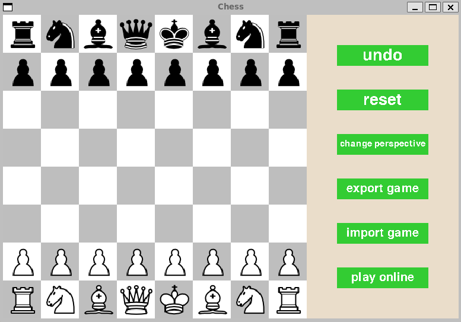
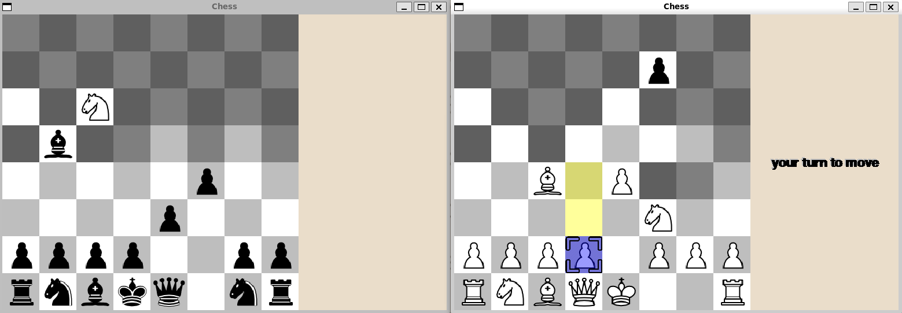

# Fog of War Chess

## A pygame chess user interface for playing standard chess as well as fog of war variant. It also supports multiplayer on local network.



This chess program supports:
* highlights for the pieces selected and valid squares to move to
* game result message
* undo move and reset board functionalities
* fog of war mode
* playing across devices
<br>
<div>
  
  <p>The view in the fog of war for different sides</p>
</div>
<br>
## How to run this code
install python and pygame

```
sudo apt-get install python3.8
sudo apt-get install python3-pygame
```
<br>
To run the chess interface, run ChessMain.py

To launch the server and play multiplayer games, change the variable HOST in server.py and controller.py to your local ip address.
Then run server.py, on the chess interface, click the button "play online" and then select the mode.
